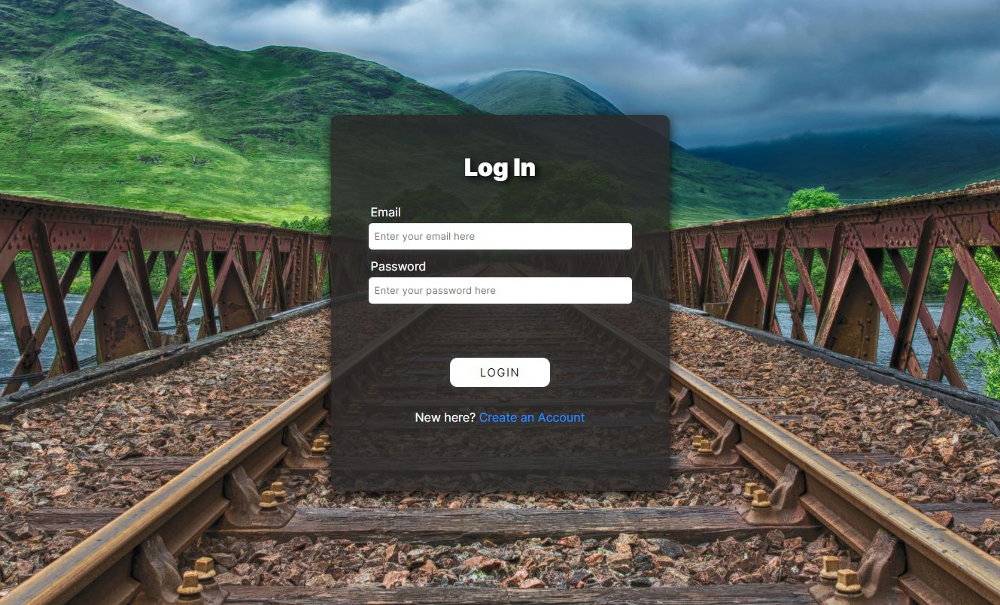
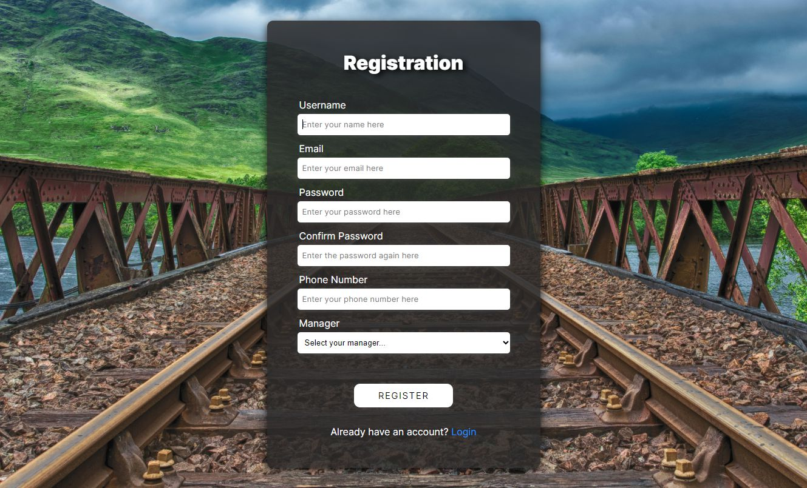
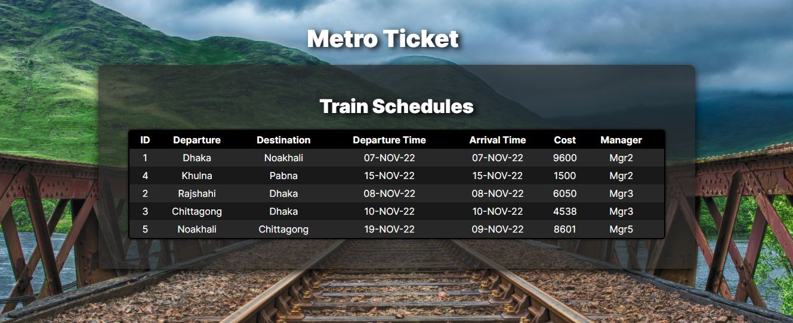

# MetroTicket
A Metro Rail Ticket Management System developed using raw PHP and advanced Oracle database concepts. 

## How to Run
Follow the instructions provided in the following StackOverflow post to set up and connect PHP with an Oracle database, and then simply start `index.php`.

The StackOverflow Post: https://stackoverflow.com/a/68221566/15324456

## Screenshots

## Diagrams

<h3 align="center">Schema Diagram</h3>

<h3 align="center">ER Diagram</h3>

<h3 align="center">Class Diagram</h3>

<h3 align="center">Use Case Diagram</h3>

<h3 align="center"> Diagram</h3>

