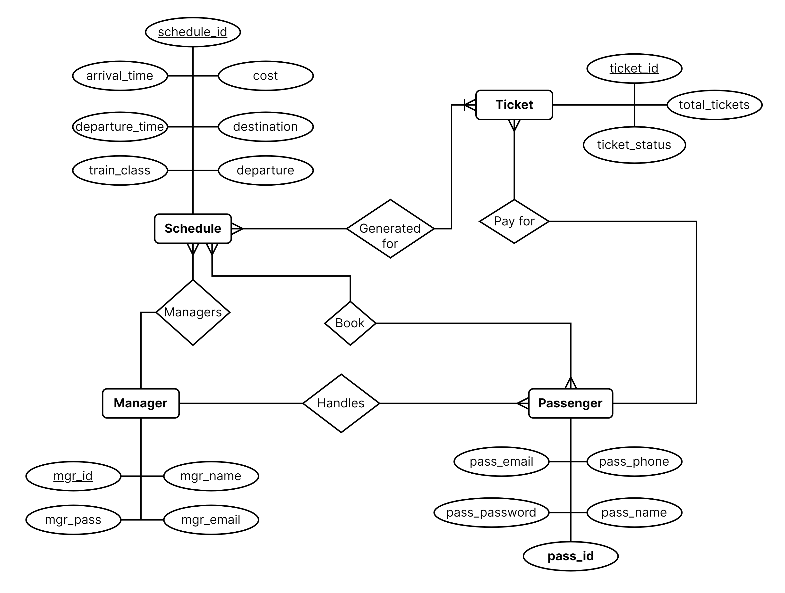

# MetroTicket
A Metro Rail Ticket Management System developed using raw PHP and advanced Oracle database concepts. 

## Diagrams

<h3 align="center">Schema Diagram</h3>

<h3 align="center">ER Diagram</h3>

<h3 align="center">Class Diagram</h3>

<h3 align="center">Use Case Diagram</h3>

<h3 align="center"> Diagram</h3>

